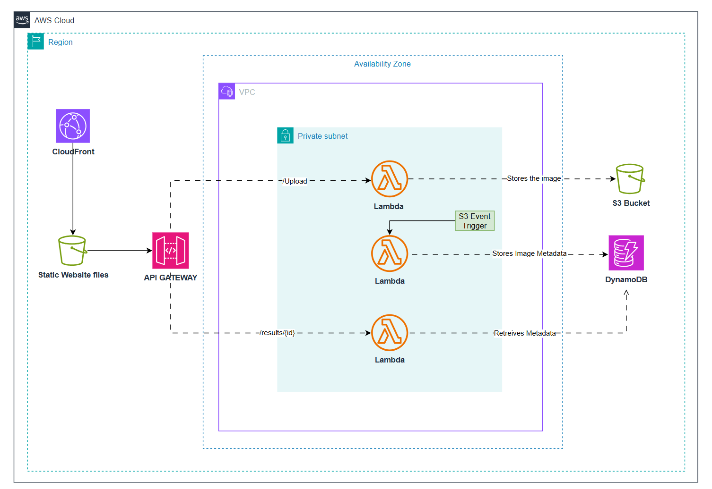

# AWS Serverless Image Metadata Pipeline

A serverless application that allows users to upload images, automatically extracts metadata (including EXIF), and stores it in DynamoDB for retrieval. Built with **AWS Lambda**, **S3**, **DynamoDB**, and a simple **JavaScript frontend**.

---

## 📐 Architecture Overview

1. **Uploader Lambda**
   - Accepts file uploads via API Gateway.
   - Stores the file in S3 using a **UUID key**.
   - Attaches the original filename as **S3 object metadata**.

2. **Processor Lambda**
   - Triggered automatically by S3 events.
   - Extracts metadata (size, content type, dimensions, EXIF).
   - Writes structured metadata into DynamoDB.

3. **Result Lambda**
   - Provides an endpoint `/result/{id}`.
   - Fetches metadata from DynamoDB by UUID.
   - Returns JSON response to the frontend.

4. **Frontend (Vanilla JS)**
   - Drag‑and‑drop or file input for image selection.
   - Preview before upload.
   - Uploads via API Gateway → Uploader Lambda.
   - Polls Result Lambda until metadata is ready.
   - Displays metadata in a clean UI.

---

## 🛠️ Technologies Used

- **AWS Lambda** (Python)
- **Amazon S3** (file storage)
- **Amazon DynamoDB** (metadata storage)
- **API Gateway** (HTTP endpoints)
- **Python** (`boto3`, `Pillow`, `requests-toolbelt`)
- **JavaScript** (frontend logic, fetch API)
- **HTML/CSS** (basic UI)

---

## 🚀 Setup Instructions

### Backend
1. Create an **S3 bucket** for uploads.
2. Create a **DynamoDB table** (partition key: `Id`).
3. Deploy the three Lambda functions:
   - `backend/upload-lambda/lambda_function.py`
   - `backend/processor-lambda/lambda_function.py`
   - `backend/results-lambda/lambda_function.py`
4. Configure environment variables:
   - `UPLOAD_BUCKET` for Uploader Lambda.
   - `DDB_TABLE` for Processor and Result Lambdas.
5. Connect Lambdas to API Gateway routes:
   - `POST /upload` → Uploader Lambda
   - `GET /result/{id}` → Result Lambda
6. Add an **S3 event trigger** for Processor Lambda.

### Networking (VPC Endpoints)
To ensure secure, private communication between your Lambdas and AWS services:
- Create **VPC endpoints** for:
  - **S3** (Gateway endpoint) → allows Lambdas to access your S3 bucket without traversing the public internet.
  - **DynamoDB** (Gateway endpoint) → ensures DynamoDB queries stay inside AWS’s private network.
- Attach these endpoints to the VPC/subnets where your Lambdas run.

### IAM Roles & Permissions
Each Lambda should have a dedicated IAM role with least‑privilege permissions:

- **Uploader Lambda Role**
  - `s3:PutObject` on your upload bucket.
- **Processor Lambda Role**
  - `s3:GetObject` on your upload bucket.
  - `dynamodb:PutItem` on your DynamoDB table.
- **Result Lambda Role**
  - `dynamodb:GetItem` on your DynamoDB table.
- **Common**
  - `logs:CreateLogGroup`, `logs:CreateLogStream`, `logs:PutLogEvents` for CloudWatch logging.

Attach these roles to the respective Lambdas during deployment.

### Lambda Dependencies

Each Lambda has specific Python requirements. In this repo, **pre‑built `.zip` packages with dependencies are already included** in each Lambda folder for convenience. If you modify the code, re‑package as shown below:

- **Uploader Lambda**
  - Requires [`requests-toolbelt`](https://pypi.org/project/requests-toolbelt/) for multipart form decoding.
  - Already packaged as `uploader.zip`.
  - To rebuild:
    ```bash
    pip install requests-toolbelt -t .
    zip -r uploader.zip .
    ```

- **Processor Lambda**
  - Requires [`Pillow`](https://pypi.org/project/Pillow/) for image processing and EXIF extraction.
  - Already packaged as `processor.zip`.
  - To rebuild:
    ```bash
    pip install Pillow -t .
    zip -r processor.zip .
    ```

- **Result Lambda**
  - Uses only `boto3` (already available in the Lambda runtime).
  - Packaged as `result.zip` with just the function code.

---

## 📊 Example Flow

1. User drags an image into the frontend.
2. Frontend uploads file → Uploader Lambda.
3. Uploader Lambda stores file in S3 with UUID key + filename metadata.
4. S3 triggers Processor Lambda → extracts metadata → saves to DynamoDB.
5. Frontend polls Result Lambda using UUID.
6. Metadata is returned and displayed to the user.

---

## 🔑 Key Design Choices

- **UUID keys only**: Prevents brittle filename parsing.
- **Filename in S3 metadata**: Clean separation of concerns.
- **Event‑driven processing**: Processor Lambda runs automatically on S3 upload.
- **Polling frontend**: Simple way to wait for async metadata extraction.

---

## 📸 INFRA OVERVIEW



---

## 📜 License
MIT License – feel free to use and adapt.
